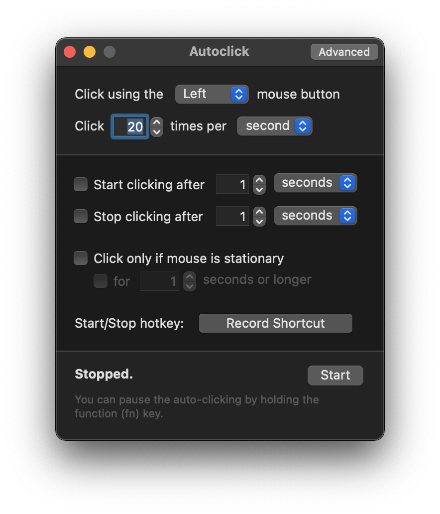

# Autoclick 2.0

A simple Mac app that simulates mouse clicks when needed. Highly configurable and easy to use.

[Download](https://mahdi.jp/apps/autoclick)

License is GNU GPLv2.

### Changelog

#### 2.0.3 (2021/2/23)

- Allow hotkeys without modifiers, [#2](https://github.com/inket/Autoclick/issues/2)

#### 2.0.2 (2021/2/17)

- Better fix for multi-monitor setups, [#1](https://github.com/inket/Autoclick/issues/1)

#### 2.0.1 (2021/2/6)

- Fixed cursor jumping in multi-monitor setups, #1

#### 2.0 (2021)

- Codesigned & notarized so that it's trusted by new versions of macOS
- Modernized codebase & added Apple Silicon support
- Will now display the accessibility permission popup if you haven't allowed it yet

#### [1.0 (2011)](https://tars.mahdi.jp/apps/autoclick-1.0.zip)

- Initial version
